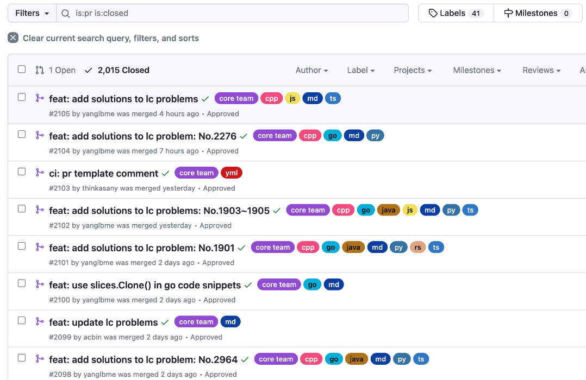
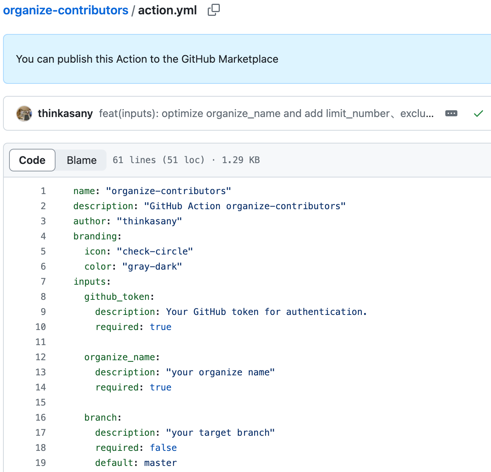
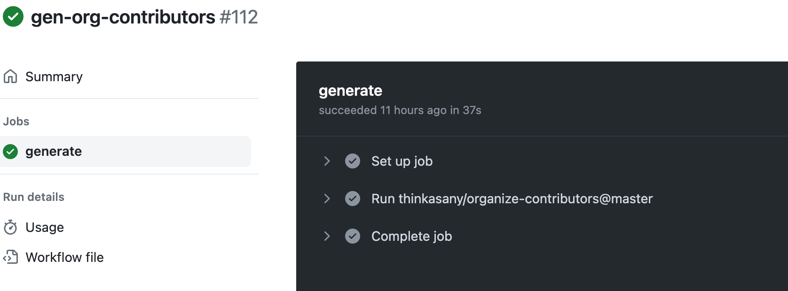
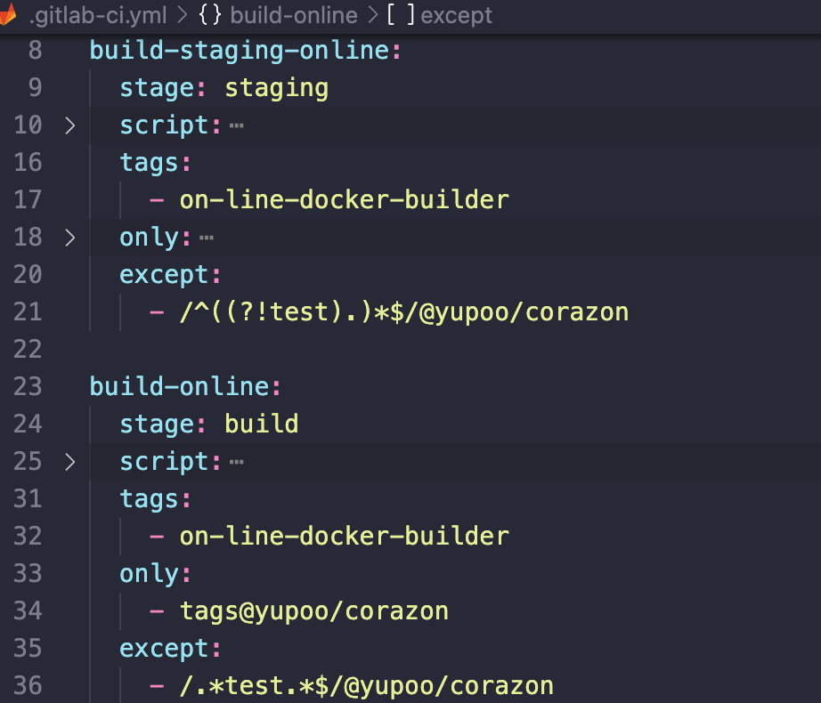
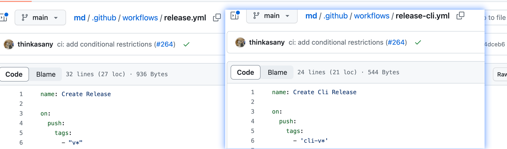
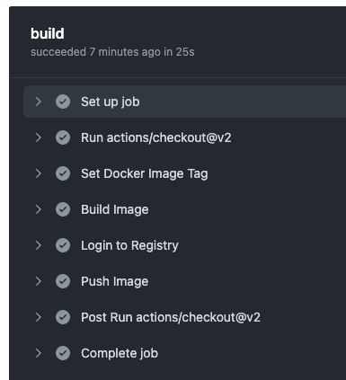
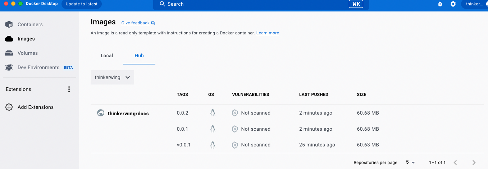

# CI 篇-Github Action

# Github Action 是什么

- 官方套话：GitHub Actions 是 GitHub 提供的一项功能，它允许您自动化软件开发工作流程。使用 GitHub Actions，您可以在代码仓库中设置自定义的 CI/CD（持续集成/持续部署）流水线，以响应各种事件，如代码推送、拉取请求（PR）的创建和关闭等。这使得开发团队能够更轻松地构建、测试和部署其应用程序。
- 我的理解：自动化，就是自动触发的一些事件，将重复的指令写成自动化脚本，能够简约效率，减轻对不同项目的理解心智，比如项目每次做完发布之前，要执行的各类操作，我还得本地先 build, 再打 tag, 再手动更新，不同项目还不一样，现在只要一个命令，完成所有流程。

# Github Action 能干什么

> Github Action 能做的事情太多了，我主要介绍我已经做过的事情

1. Npm cli 的自动发包 [https://github.com/doocs/md/pull/261/files](https://github.com/doocs/md/pull/261/files)

   1. 就我们团队而言，发布工具是已经抽成 npm 包的了，后续也许会拓展，npm 发布的过程很简单，npm login、 npm publish，但是需要把源切回 npm 的镜像(但是为了更快的下载速度我们还得切回源，来回切本就是一个没有意义且浪费时间的事情)，而且 login 还需要输入账号密码，如果做成 ci 的话，我们只需要一个 token，配置在 secret 中，就算是多个不同的项目也只输入一个固定指令，剩下的交给 ci。
   2. 我们可以开发一个图管 cli，用于搭建一些项目模版，比如之前用到的 express 代理 dist 文件实现 dev 环境的模版代码，或者后面需要做一些简单项目的时候，可以配置进去。然后就可以通过脚手架快速生成工程模板。

2. Ci lint 检查 [https://github.com/doocs/leetcode/blob/main/.github/workflows/prettier.yml](https://github.com/doocs/leetcode/blob/main/.github/workflows/prettier.yml)

你可以有疑问，这些不应该是项目本地该做的事情么，但是其实这些都是可以被绕过的，比如在本地删除掉那些依赖或者文件，什么不符合规范的代码都能提交，但是如果放到 ci 层面的话，你提交了，我们就会在 commit 之后对提交的文件进行处理，这是绕不过去的，除了格式风格之外，我们甚至可以思考做一些单测的检查，比如 antd 的测试，单测、快照对比差异 etc...说到这，也许我们可以讨论一下最近非常火的 Oxlint，进行一波小讨论。[https://juejin.cn/post/7312374060435030053](https://juejin.cn/post/7312374060435030053)

3. 数据统计 [https://github.com/thinkasany/organize-contributors](https://github.com/thinkasany/organize-contributors)
   市面上针对 commit 的统计只有针对项目级别的，但是一个组织下面有多个项目，又该如何统计呢，于是我开发了一款 action，并复用于多个大型开源社区以及咱们自己的 fe team，其实 github action 也可以用 js 开发，然后在其他的项目中通过 yml 引用这个 action 下的仓库就好了。近期年终项目的桑葚图页面其实完全就可以通过一个在线文档来维护，然后添加不同的负责人之后，写个定时任务，定期更新站点。
4. 签到助手 [https://github.com/thinkasany/cordcloud-action-js](https://github.com/thinkasany/cordcloud-action-js)

做了一个签到的工具，每天点一遍签到功能容易忘记，但是作为开发者就可以开发一个自己的小工具，让技术来便利生活。但是针对团队和公司而言，我们可以一起思考一个有价值的项目，来减轻一些重复的工作。

5. 针对 pr 做一些处理 [https://github.com/thinkasany/pr-label-action](https://github.com/thinkasany/pr-label-action)

这是一个自动添加 label 的工具，可以针对提交的文件类型添加 label，我们都不用点开详情，都可以了解到这个 pr 对什么文件进行了修改，可以减轻一定上的理解，比如动了核心配置类的文件，一眼就看出来了，可以针对团队的需要定制化开发适合图管项目宝宝体质的 action。



# 怎么做到的

一、配置 yml，通过不同的监听事件，去执行不同的 ci，执行对应的任务

- 定时任务

```yaml
on:
  schedule:
    - cron: '0 0/12 * * *'
  workflow_dispatch:
```

- 监听 pr 事件

```yaml
on:
  pull_request_target:
    types: [opened, edited, reopened, synchronize]
```

- 监听 push 事件

```yaml
on:
  push:
    branches: [main]
```

二、开发自己的 action，根据上面几个项目可以参考实现，代码都是 js 的

> [https://github.com/thinkasany/organize-contributors](https://github.com/thinkasany/organize-contributors) 这边以这个项目为例，示范开发一个 action 需要的步骤

1. 配置 yml 文件

简单分析一下这个 yml 文件

```yaml
`name: test-doocs

on:
  schedule:
    - cron: "0 0 * * *"
  workflow_dispatch:

jobs:
  checkin:
    runs-on: ubuntu-latest
    steps:
      - uses: thinkasany/organize-contributors@master
        with:
          organize_name: 'doocs'
          github_token: ${{ secrets.GH_TOKEN }}
          png_path: images-doocs/contributors.png
          json_path: json-doocs/data.json
          branch: 'master' # 不配置默认master分支
          committer_name: 'think-bot' # 不配置默认 actions-user
          committer_email: 'thinkasany@163.com' # 不配置默认actions@github.com
          # commit_message: 'chore: 自定义的message' # 不配置默认chore: update contributors [skip ci]
```

① 监听了定时任务事件，每天都会执行这个 ci 脚本

② uses: thinkasany/organize-contributors@master，使用用户 thinkasany 的 organize-contributor 仓库下 master 分支的代码，这个 ci 还有一个好处就是，不需要手动去更新版本，会执行引用仓库下最新的代码，但是如何解决锁定版本呢？那就是那些 v2、v3 分支....

③ with 配置，就相当于函数入参，传入 token 以及一些其他需要的参数。

这些入参的配置在 action.yml 中配置，可以填写 required 来保证 token 必传，否则报错提示用户完善配置信息。



④ 核心代码

使用 actions 库的能力, 读取到我们需要的配置，然后就是使用我们平常的开发习惯，执行普通的 js 代码逻辑了。

```yaml
const core = require("@actions/core");
const github = require("@actions/github");

const orgName = core.getInput("organize_name", { required: true });
const token = core.getInput("github_token", { required: true });
```

⑤ 发布

通过 @vercel/ncc 打包上传 dist/或者 docker image，别人就可以直接通过指定你的仓库来引用这个 action 了



我们可以观察一次具体的执行信息来讲解一下工作流程。[https://github.com/doocs/.github/actions/runs/7242004428/job/19726836104](https://github.com/doocs/.github/actions/runs/7242004428/job/19726836104)

总结：我们可以借用 puppeteer 去实现很多能力，Chrome Headless 必将成为 web 应用**自动化\*\***测试\*\*的行业标杆。使用 `Puppeteer`，相当于同时具有 Linux 和 Chrome 双端的操作能力，应用场景可谓非常之多。还可以作为性能分析，反正浏览器能做的事情都能做，这边我数据分析完的 canvas 图标也是通过 puppeteer 截图去做的。

## `Puppeteer` 的能力

- 生成页面的截图和 PDF。
- 抓取 SPA 并生成预先呈现的内容（即“SSR”）。
- 从网站抓取你需要的内容。
- 自动表单提交，UI 测试，键盘输入等
- 创建一个最新的自动化测试环境。使用最新的 JavaScript 和浏览器功能，直接在最新版本的 Chrome 中运行测试。
- 捕获您的网站的时间线跟踪，以帮助诊断性能问题。

三、使用 actions/github-script@v5，直接在 yml 文件中使用 js 进行开发。[https://github.com/doocs/leetcode/pull/2103](https://github.com/doocs/leetcode/pull/2103)

有时候为了一个简单的功能去开发一个 action 的确划不来，然后你不熟悉 sh 的语法的话就可以直接在上面写 js，或者可以参考 facebook/react 的项目，他们也有这么做。

对于咱们团队而言，可以做一些抄送通知的任务也行的。

# 回顾 gitlab-ci

图管中，大部分项目是通过 tag 事件来触发 ci 构建，然后根据正则表达式区分 except 中 tag 来执行不同生产环境的构建。



在 github-ci 中，也有很类似的用法，通过不同的 tag 名称触发不同的 ci 构建，cli-v _执行 cli 的 npm 发包 ci，只有 v_ 的话就是 web 端的发版 ci。



个人感触：其实本身我是看不懂公司的 gitlab-ci 的，但是自从我在 github 上玩了这么多 ci 之后，回顾这个 gitlab-ci 其实没怎么查阅资料就能明白大概意思了，并且发现并优化了一个配置，先前的账号密码都直接暴露在这个文件中，但是在 github 中我们一定不会这么做，然后稍微看了一下，发现的确是可以抽到 secret 中的，也许后续我们还会在 github-action-ci 的探索中，不断发现能够优化公司内部 ci 的流程，亦或是我们也许能打造一条图管独特的 github ci 路线，降低开发和理解成本，增加效率。其实 gitlab-ci 和 github-action 能力差不多，只是 action 会更便捷一些可以用 js 实现，当我们想开发 gitlab-ci 的时候，其实也可以先用 github-action 写个小 demo 实践一下，用我们最熟悉的 js 先做完，再交给个 gpt 翻译成 sh 的代码，去完善我们所需要的功能。

# 使用 github-action 从零到一完成自动构建镜像

参考文献：GitHub Actions 自动构建镜像 并发布到 Docker Hub

[https://cloud.tencent.com/developer/article/1970757](https://cloud.tencent.com/developer/article/1970757)

我的实践代码：[https://github.com/thinkasany/docs/pull/31](https://github.com/thinkasany/docs/pull/31)

action 流程：[https://github.com/thinkasany/docs/actions/runs/7258161555](https://github.com/thinkasany/docs/actions/runs/7258161555)

> - 通过 GitHub 的源代码自动构建镜像
> - 将镜像上传到 Docker Hub
> - 自动部署：远程[服务器](https://cloud.tencent.com/act/pro/promotion-cvm?from_column=20065&from=20065) pull Docker Hub

镜像 push 到 docker hub

```yaml
name: Docker Image CI/CD
on:
  push:
    tags:
      - 'v*'
jobs:
  # 构建并上传 Docker镜像
  build:
    runs-on: ubuntu-latest # 依赖的环境
    steps:
      - uses: actions/checkout@v2
      - name: Set Docker Image Tag
        run: |
          DOCKER_TAG=$(echo "${{ github.ref }}" | sed -n 's/refs\/tags\/v//p')
          echo "DOCKER_TAG=${DOCKER_TAG}" >> $GITHUB_ENV
      - name: Build Image
        run: |
          docker build -f Dockerfile -t thinkerwing/docs:${DOCKER_TAG} .
      - name: Login to Registry
        run: docker login --username=${{ secrets.DOCKER_USERNAME }} --password ${{ secrets.DOCKER_PASSWORD }}
      - name: Push Image
        run: |
          docker push thinkerwing/docs:${DOCKER_TAG}
```





# Docker 自动部署

```yaml
# Docker 自动部署
deploy-docker:
  needs: [build]
  name: Deploy Docker
  runs-on: ubuntu-latest
  steps:
    - name: Deploy
      uses: appleboy/ssh-action@master
      with:
        host: ${{ secrets.HOST }} # 服务器ip
        username: ${{ secrets.HOST_USERNAME }} # 服务器登录用户名
        password: ${{ secrets.HOST_PASSWORD }} # 服务器登录密码
        port: ${{ secrets.HOST_PORT }} # 服务器ssh端口
        script: |
          # 切换工作区
          cd simcaptcha
          # 下载 docker-compose.yml
          wget -O docker-compose.yml https://raw.githubusercontent.com/yiyungent/SimCaptcha/master/docker-compose.yml
          # 停止并删除旧 容器、网络、挂载点
          #docker-compose down                          # TODO: docker-compose: command not found. 不知道为什么找不到 docker-compose，但直接连接服务器执行就可以
          /usr/local/python3/bin/docker-compose down
          # 删除旧镜像
          docker rmi yiyungent/simcaptcha 
          docker rmi yiyungent/simcaptcha-client
          # 登录镜像服务器
          docker login --username=${{ secrets.DOCKER_USERNAME }} --password ${{ secrets.DOCKER_PASSWORD }} 
          # 创建并启动容器
          #docker-compose up -d --build
          /usr/local/python3/bin/docker-compose up -d --build
```

# 讨论环节

针对我的分享，希望对大家关于 ci 和 github action 的了解有加强，希望得到大家的指点，学习到更多关于 ci 的知识，然后为团队生产更多的自动化工具。也希望大家能有所收获，让技术便利生活，做一些有成就感的事情。

# 参考文献分享

> 慢慢的接触实用的 action 相关的链接可以贴到这里

1. github-action 在 antd 团队中的使用

https://ant.design/docs/blog/github-actions-workflow-cn

2. 一个 action 工具集，很酷的一个组织，做了各类 action

[https://github.com/actions-cool](https://github.com/actions-cool)

3. 常规场景，单测，用现在比较火的 vitest 速度很快，action 可以执行项目中的脚本，通过 ci 观察是否 pr 修改符合预期，再决定是否 merge，更加严谨可靠。

[https://github.com/ant-design/ant-design-web3/blob/main/.github/workflows/test.yml](https://github.com/ant-design/ant-design-web3/blob/main/.github/workflows/test.yml)

4. 通过 escpos.GetDeviceList("USB")可以连接热敏打印机，甚至我们可以做一些其他的物联网操作，定时任务或监听某些特定事件去执行一些事情。

[https://juejin.cn/post/7311707089498456083](https://juejin.cn/post/7311707089498456083)

5. github 接口文档

[https://docs.github.com/zh/rest?apiVersion=2022-11-28](https://docs.github.com/zh/rest?apiVersion=2022-11-28)
