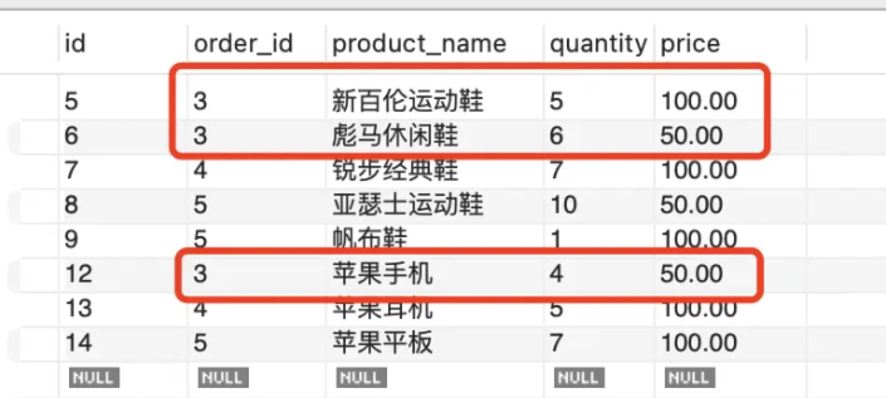

# [MySQL 的事务和隔离级别](https://juejin.cn/book/7226988578700525605/section/7228943087936995386)
根据 - [36.SQL 综合练习](/docs/nest/36/36.md) 创建数据库

## 为什么要用事务
如果是两个 update 的语句，一个把订单详情表数量修改了，一个把订单表的总金额修改了。但是改订单总金额的那个 sql 执行失败了。

这时候怎么办？

数量已经改了，但是总金额没改成功，就对不上了。

### 
```
select * from order_items
```

## 



## others
